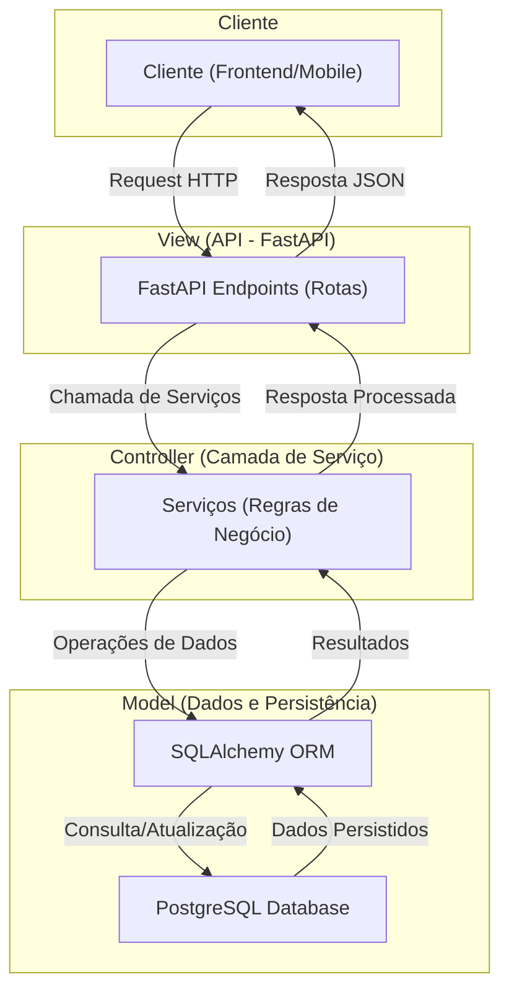

# Desafio Bootcamp: API Customer

Este projeto é uma aplicação FastAPI que utiliza **Docker** para gerenciamento de containers, UV  dependências e serviços relacionados, como banco de dados PostgreSQL. O controle de tarefas é realizado via **Makefile**, com suporte a comandos para testes, linting, formatação e execução.

## Pré-requisitos

Antes de começar, certifique-se de que sua máquina possui os seguintes itens instalados:

### 1. **Python 3.12**  
   Certifique-se de que o Python 3.12 está instalado em sua máquina. Caso não esteja, baixe-o [aqui](https://www.python.org/downloads/).

### 2. **Docker**  
   Instale o Docker para gerenciar os containers do projeto.  
   - [Guia de Instalação do Docker](https://docs.docker.com/get-docker/).

### 3. **Docker Compose**  
   O Docker Compose é necessário para orquestrar múltiplos containers.  
   - [Guia de Instalação do Docker Compose](https://docs.docker.com/compose/install/).

### 4. **`uv`**  
   O **`uv`** é um gerenciador leve para criação e manipulação de ambientes virtuais Python.  
   - [Guia de Instalação do uv](https://docs.astral.sh/uv/getting-started/installation/)

### 5. **Make**

O Make é usado para executar os comandos definidos no **Makefile** do projeto. Ele vem pré-instalado na maioria dos sistemas Unix/Linux e macOS, mas em sistemas Windows você pode instalá-lo manualmente:

#### No Linux/Ubuntu:
   ```bash
   sudo apt install make
   ```

#### No macOS (via Homebrew):
   ```bash
   brew install make
   ```

#### No Windows:
   - Instale o [MinGW](https://osdn.net/projects/mingw/releases/) e adicione o caminho do executável do `make` ao `PATH` do sistema.
   - Ou, se estiver usando o WSL (Windows Subsystem for Linux), instale o Make no ambiente Linux:

     ```bash
     sudo apt install make
     ```

   Após a instalação, verifique se o Make foi instalado corretamente:
   ```bash
   make --version
   ```
---

## Configuração do Ambiente

Siga os passos abaixo para configurar e executar o projeto:

1. **Clone o repositório**:
   ```bash
   git clone https://github.com/edussm/desafio-final-bootcamp.git
   cd desafio-final-bootcamp
   ```

2. **Garanta que os pre-requisitos estão instalados**

2. **Inicie os containers do ambiente de desenvolvimento**:
   ```bash
   make start-dev-containers
   ```

3. **Aplique migrações de banco de dados**:
   ```bash
   make migrate-up
   ```

4. **Execute a aplicação localmente**:
   ```bash
   make run-dev
   ```

   O servidor estará disponível em [http://127.0.0.1:8000](http://127.0.0.1:8000). A documentação da API poderá ser acessada [aqui](http://127.0.0.1:8000/docs)

---

## Comandos Disponíveis no Makefile

O **Makefile** fornece uma série de comandos úteis para facilitar o desenvolvimento. Aqui estão os principais:

### Ambiente

- **`make start-dev-containers`**: Inicia os containers necessários para o ambiente de desenvolvimento.
- **`make stop-dev-containers`**: Para os containers do ambiente de desenvolvimento.
- **`make start-test-containers`**: Inicia os containers para testes.
- **`make stop-test-containers`**: Para os containers de testes.
- **`make stop-all-containers`**: Para todos os containers (produção, desenvolvimento e testes).

### Linting e Formatação

- **`make lint`**: Formata o código com as ferramentas `black`, `isort` e `ruff`.
- **`make check-lint`**: Verifica a formatação do código sem modificá-lo.

### Testes

- **`make test`**: Executa os testes unitários e de integração utilizando `pytest` no ambiente de testes.
- **`make coverage`**: Gera um relatório de cobertura de código.

### Limpeza

- **`make clean`**: Remove arquivos temporários e de cache, como `__pycache__`, `.pytest_cache` e relatórios de cobertura.

### Migrações

- **`make migrate-up`**: Aplica migrações ao banco de dados do ambiente de desenvolvimento.

### Execução

- **`make run-dev`**: Executa a aplicação no ambiente de desenvolvimento.

### Exemplos de chamadas
#### Criar um cliente
```bash
curl -X 'POST' \
  'http://127.0.0.1:8000/api/v1/customers' \
  -H 'accept: application/json' \
  -H 'Content-Type: application/json' \
  -d '{
  "name": "John Doe",
  "email": "j@example.com",
  "phone_number": "1999888111",
  "document": "111222333444555",
  "type": "individual",
  "is_active": true
}'
```
#### Buscar todos os clientes com paginação
```bash 
curl -X 'GET' \
  'http://localhost:8000/api/v1/customers?offset=0&limit=10' \
  -H 'accept: application/json'

```

#### Buscar todos os clientes filtrando pelo nome
```bash 
curl -X 'GET' \
  'http://localhost:8000/api/v1/customers?name=John' \
  -H 'accept: application/json'

```

#### Recuperar cliente pelo ID (dado um id criado anteriormente)
``` bash
curl -X 'GET' \
  'http://127.0.0.1:8000/api/v1/customers/01934c92-3bb7-713b-9bb0-e97878f951c6' \
  -H 'accept: application/json'
```

#### Recuperar a contagem de clientes cadastrados
```bash
curl -X 'GET' \
  'http://127.0.0.1:8000/api/v1/customers/statistics/count' \
  -H 'accept: application/json'
```

#### Atualizar um registro por ID
```bash
curl -X 'PATCH' \
  'http://127.0.0.1:8000/api/v1/customers/01934c92-3bb7-713b-9bb0-e97878f951c6' \
  -H 'accept: application/json' \
  -H 'Content-Type: application/json' \
  -d '{
  "name": "John Doe Jr." 
}'
```

#### Remover um cliente (dado um id criado anteriormente)

```bash
curl -X 'DELETE' \
  'http://localhost:8000/api/v1/customers/01934c92-3bb7-713b-9bb0-e97878f951c6' \
  -H 'accept: */*'
```

---
## Arquitetura

Este projeto segue a arquitetura MVC, o diagrama abaixo ilustra a interação entre as camadas.



## Estrutura do Projeto

```plaintext
meu-projeto/
├── app/                  # Código principal da aplicação
├── tests/                # Testes automatizados
├── alembic/              # Migrações do banco de dados
├── docker-compose.yml    # Configuração do Docker Compose
├── Makefile              # Comandos de automação
├── pyproject.toml        # Dependências e configurações do projeto
└── README.md             # Documentação do projeto
```

---

## Fluxo de Desenvolvimento

1. Faça alterações no código dentro da pasta `app/`.
2. Execute `make lint` para garantir que o código esteja formatado corretamente.
3. Escreva e execute testes com `make test`.
4. Aplique migrações ao banco, se necessário, com `make migrate-up`.
5. Teste localmente usando `make run-dev`.

---

## Contribuição

Contribuições são bem-vindas! Antes de enviar um pull request, certifique-se de:

1. Rodar `make check-lint` e corrigir problemas de linting.
2. Garantir que todos os testes estão passando com `make test`.

---

## Referências

- [FastAPI Documentation](https://fastapi.tiangolo.com/)
- [Docker Documentation](https://docs.docker.com/)
- [Ruff Documentation](https://beta.ruff.rs/docs/)
- [Black Documentation](https://black.readthedocs.io/)

